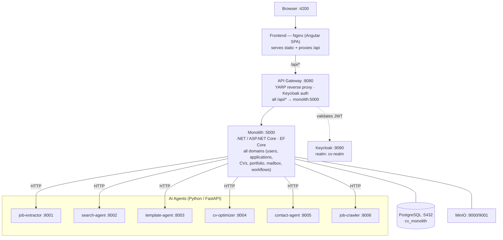

# Propel

> **Formerly CV Generator** — a full-stack, AI-powered platform for generating tailored CVs, tracking job applications, and managing a career portfolio. Originally built as .NET microservices; **now consolidated into a single monolith** with a YARP gateway, an Angular frontend, and a set of Python AI agents.

## Features

- **AI CV Generation** — submit a job description and get a tailored CV via a pipeline of AI agents (job extraction, profile matching, template rendering, ATS optimization, delivery)
- **Job Application Tracking** — dashboard, list, kanban, calendar, and analytics views
- **Portfolio Management** — projects, skills, experience, education, certifications, languages, social links, and more
- **Mailbox & Contacts** — contact import, AI-assisted draft/reply, email scheduling
- **AI Autofill** — populate forms from a pasted description via a centralized direct-AI proxy
- **Keycloak SSO** — OpenID Connect / JWT authentication

## Architecture

A single .NET monolith serves every domain. The gateway (YARP) terminates Keycloak auth and proxies all `/api/*` traffic to the monolith. The Python AI agents run as standalone HTTP services the monolith calls by hostname.



## Tech Stack

| Layer | Technology |
|---|---|
| **Frontend** | Angular 21, TypeScript, RxJS, Signals, SCSS |
| **Backend** | .NET / ASP.NET Core, EF Core, YARP reverse proxy |
| **AI Agents** | Python 3.11, FastAPI, LangChain (OpenRouter-first with provider fallback) |
| **Database** | PostgreSQL 17 (single `cv_monolith` DB; pgvector for search) |
| **Auth** | Keycloak 26.2, OpenID Connect, JWT |
| **Storage** | MinIO (S3-compatible, for CV PDFs) |
| **Container** | Docker, Docker Compose, Nginx |

## Prerequisites

- Docker & Docker Compose
- (Local dev only) .NET SDK, Node.js 20+, Python 3.11+

## Quick Start (Docker — full stack)

```bash
git clone <repo-url>
cd propel/monolith

# AI agents read LLM keys from their own .env files:
#   ai_agents/services/<agent>/.env   (OpenRouter / provider keys)

docker compose up --build -d
```

First boot takes a couple of minutes (Keycloak imports the `cv-realm` realm, ~60s). Then open **http://localhost:4200**.

Check status / logs:

```bash
docker compose ps
docker compose logs -f monolith
```

Stop:

```bash
docker compose down          # keep data
docker compose down -v       # also wipe volumes (resets DB)
```

### Default credentials

| Type | Username | Password |
|---|---|---|
| Keycloak admin | `admin` | `admin` |

## Services & Ports

All defined in `monolith/docker-compose.yml`. Ports are overridable via `.env` (see variables below).

| Service | Container | Host Port | Notes |
|---|---|---|---|
| Frontend (Nginx) | `cv-frontend` | 4200 | Angular SPA, proxies `/api` → gateway |
| API Gateway | `cv-api-gateway` | 8080 | YARP + Keycloak auth → monolith |
| Monolith | `cv-monolith` | 5000 | .NET app, all domains; `/health` |
| PostgreSQL | `cv-monolith-db` | 5432 | database `cv_monolith` |
| Keycloak | `cv-keycloak` | 9090 | realm `cv-realm` |
| MinIO | `cv-minio` | 9000 / 9001 | S3 storage + console |
| Job Extractor | `cv-job-extractor` | 8001 | extract requirements from a job description |
| Search Agent | `cv-search-agent` | 8002 | RAG profile matching |
| Template Agent | `cv-template-agent` | 8003 | render CV templates |
| CV Optimizer | `cv-optimizer` | 8004 | ATS validation + keyword optimization |
| Contact Agent | `cv-contact-agent` | 8005 | delivery / contact handling |
| Job Crawler | `cv-job-crawler` | 8006 | job board crawling |

## Local Development (without Docker)

`monolith/dev.sh` starts the infra + AI agents in Docker and leaves the monolith, gateway, and frontend to run natively.

```bash
cd monolith
./dev.sh            # brings up postgres, keycloak, minio, and the 6 AI agents

# then, in separate terminals:
cd monolith/backend && dotnet run       # monolith :5000
cd monolith/gateway && dotnet run       # gateway :8080
cd frontend && npm install && ng serve  # frontend :4200 (proxies /api → :8080)
```

The monolith's connection string comes from `CONNECTION_STRING` / `ConnectionStrings:DefaultConnection`; the gateway resolves the monolith address from `MONOLITH_HOST` / `MONOLITH_PORT`.

## Project Structure

```
propel/
├── monolith/
│   ├── docker-compose.yml     # full stack: db, keycloak, monolith, gateway, agents, minio, frontend
│   ├── dev.sh                 # bring up infra + agents for native dev
│   ├── Dockerfile             # monolith image
│   ├── backend/               # the .NET monolith (all Controllers, Data, Models, Services, Migrations)
│   ├── gateway/               # YARP reverse proxy + Keycloak auth + realm import
│   └── agents/                # (in progress) consolidated Python agents
│
├── frontend/                  # Angular SPA (pages, services, guards, interceptors, nginx.conf)
│
└── ai_agents/
    └── services/              # Python AI agents, one dir per agent (built by the monolith compose)
        ├── job-extractor/  search-agent/  template-agent/
        ├── cv-optimizer/   contact-agent/ job-crawler/
        ├── orchestrator/                  # pipeline coordinator
        └── common-tools/                  # shared Python library
```

> The `ai_agents/services/*` agents are still built by `monolith/docker-compose.yml`. Consolidating them into `monolith/agents/` is an in-progress follow-up, after which `ai_agents/` can be removed.

## Environment Variables

Set in `monolith/.env` (compose reads it) or the shell. Defaults shown are the compose fallbacks.

| Variable | Default | Purpose |
|---|---|---|
| `MONOLITH_PORT` | `5000` | monolith host port |
| `MONOLITH_DB_PORT` | `5432` | Postgres host port |
| `GATEWAY_PORT` | `8080` | gateway host port |
| `FRONTEND_PORT` | `4200` | frontend host port |
| `KEYCLOAK_EXTERNAL_PORT` | `9090` | Keycloak host port |
| `KEYCLOAK_ADMIN_USERNAME` / `_PASSWORD` | `admin` / `admin` | Keycloak admin |
| `MINIO_ROOT_USER` / `_PASSWORD` | `minioadmin` / `minioadmin` | MinIO credentials |
| `CONNECTION_STRING` | `Host=postgres;…;Database=cv_monolith` | monolith DB connection (Docker) |

LLM/provider keys for the AI agents live in each agent's `ai_agents/services/<agent>/.env`.
